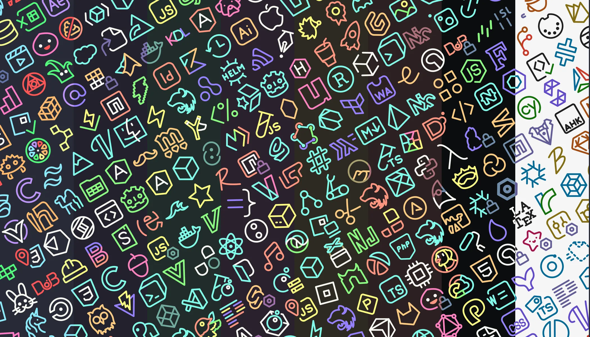
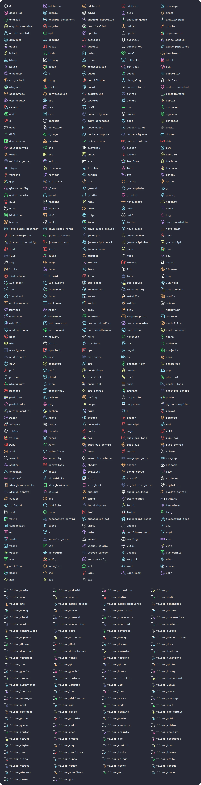
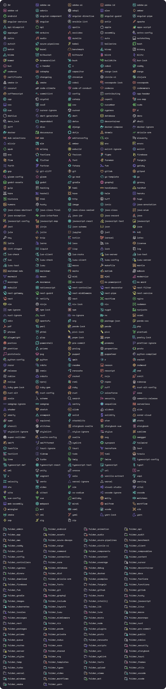
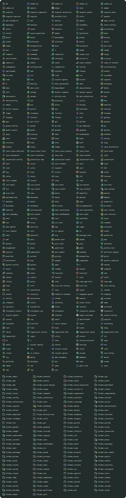
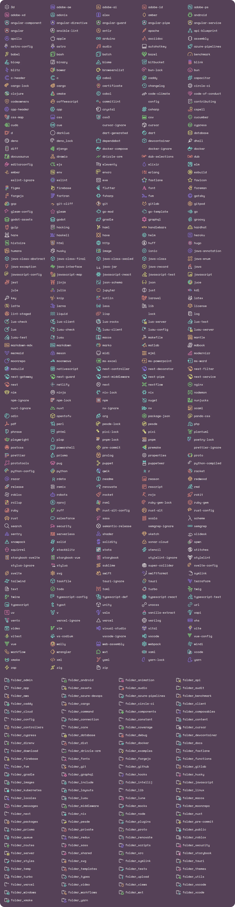
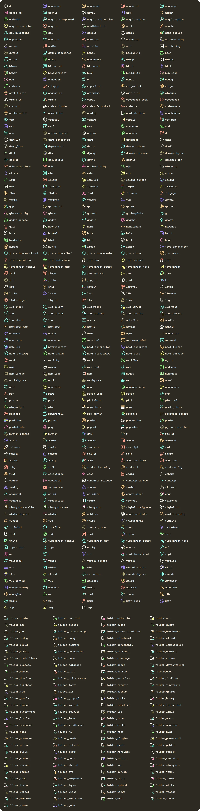
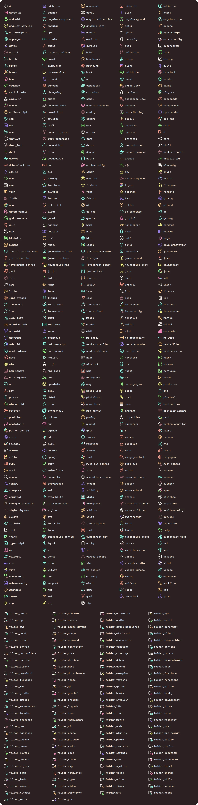
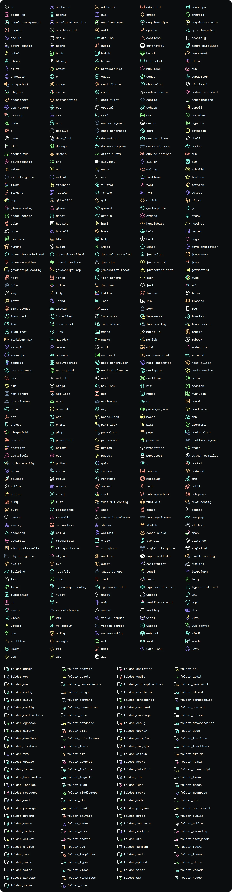
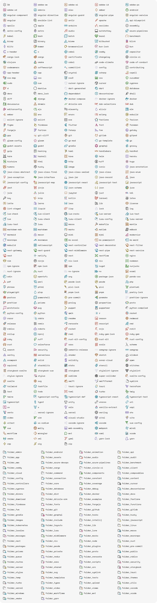

<h3 align="center">
  <br>
  
    Unofficial. Catppuccin icons + Dracula Theme + Dracula PRO
</h3>

<p align="center">
  
  
  
</p>

<p align="center">
  
</p>

## Previews

<details>
  <summary>🦇 Dracula</summary>
  
</details>
<details>
  <summary>🧛🏻 PRO</summary>
  
</details>
<details>
  <summary>🗡 Blade</summary>
  
</details>
<details>
  <summary>⚰️ Buffy</summary>
  
</details>
<details>
  <summary>🎩 Lincoln</summary>
  
</details>
<details>
  <summary>🦹🏻 Morbius</summary>
  
</details>
<details>
  <summary>♰ Van Helsing</summary>
  
</details>
<details>
  <summary>🍷 Alucard</summary>
  
</details>

## How to build

1. Install dependencies:
   ```bash
   pnpm install
   ```

2. **(Optional)** If you have Dracula Pro, copy the `env.dracula-pro-palette` template to `.env` and fill in the corresponding colors.

3. Generate the icons:
   ```bash
   pnpm run icons
   ```

4. Build the extension:
   ```bash
   pnpm run build
   ```

## 💝 Thanks to
- [zenorocha](https://github.com/zenorocha)
- [PraZ](https://github.com/prazdevs)
- [thang-nm](https://github.com/thang-nm)

&nbsp;

<p align="center">
 Copyright (c) 2023 Catppuccin<br>
 Copyright (c) 2023 thang-nm<br>
 Copyright (c) 2026 kanin-020<br>
</p>

<p align="center">
  <a href="https://github.com/catppuccin/catppuccin/blob/main/LICENSE">
    
  </a>
</p>
